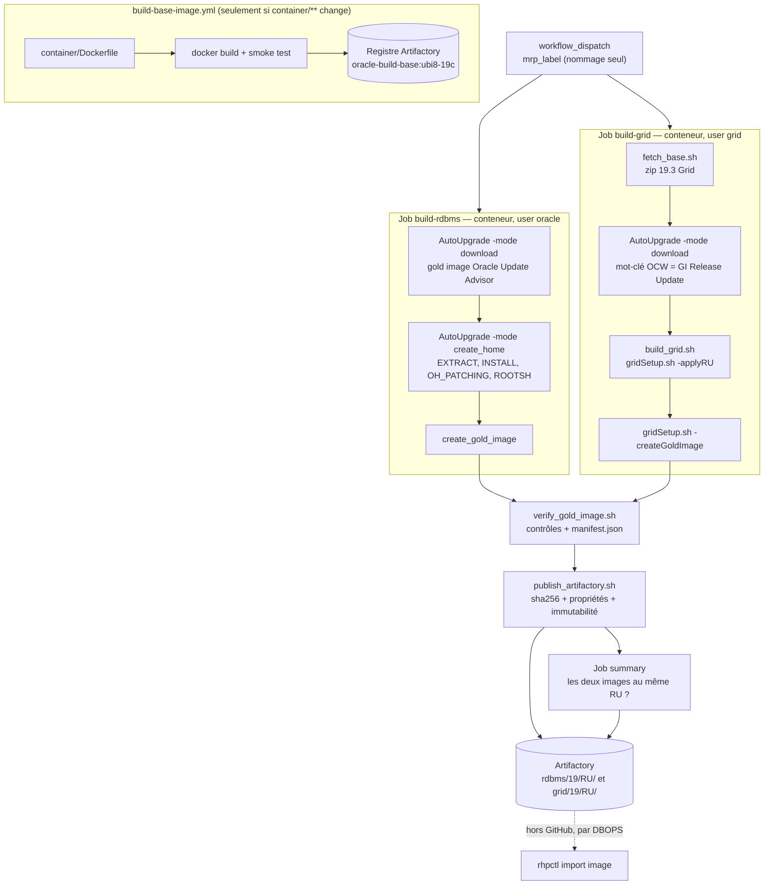

# Oracle 19c gold images — GitHub Actions → Artifactory → FPP

Produit, à chaque MRP mensuel, deux zips de gold image importables tels quels par
`rhpctl import image` :

| Image | Fichier | `-imagetype` |
| --- | --- | --- |
| RDBMS | `db_<MRP>.zip` | `ORACLEDBSOFTWARE` |
| Grid Infrastructure | `gi_<MRP>.zip` | `ORACLEGISOFTWARE` |

L'import dans FPP est fait par DBOPS, hors de ce dépôt.

---

## 1. Principes

1. **Build en conteneur, sans aucun état.** Tout s'exécute dans `oracle-build-base` (UBI 8, aucun
   binaire Oracle), sans volume monté : le conteneur travaille dans son propre système de fichiers
   et emporte tout en disparaissant. Aucun runner n'est provisionné à l'avance, aucun n'est
   privilégié — n'importe lequel portant le label `oracle-build` convient. L'image elle-même est
   immuable et n'est reconstruite que quand `container/**` change.
2. **Home construit from scratch à chaque run.** Rien n'est réutilisé d'un run à l'autre : pas de
   home « de référence » qui dérive. Côté Grid on part du zip 19.3 stocké dans Artifactory ; côté
   RDBMS, de la gold image fournie par l'Oracle Update Advisor.
3. **Jamais d'`opatch apply` manuel.** Côté Grid, `gridSetup.sh -applyRU/-applyOneOffs` en mode
   software-only. Côté RDBMS, AutoUpgrade assemble le home à partir d'une gold image déjà patchée.
4. **Une seule image par type** pour tout le parc RHEL 7/8/9 : le relink fait par FPP au
   `add workingcopy` absorbe la différence d'OS. Build sur UBI 8.
5. **Aucun numéro de patch nulle part.** AutoUpgrade résout le jeu recommandé des deux côtés ; la
   sécurité vient d'un contrôle a posteriori des versions construites, pas d'une saisie.
6. **Un compte MOS reste indispensable.** AutoUpgrade interroge MOS/ARU et l'Oracle Update Advisor
   à chaque run. Le keystore qui porte ces identifiants est recréé **dans chaque job**, à partir des
   secrets GitHub, puis meurt avec le conteneur.
7. **Rien de sensible dans le dépôt** : ni zip Oracle, ni patch, ni identifiant, ni keystore.

---

## 2. Vue d'ensemble



---

## 3. Pourquoi deux processus différents

**AutoUpgrade télécharge pour les deux, n'installe que le RDBMS.** Son mode `-patch` résout et
rapatrie aussi bien les patches de base de données que le Grid Infrastructure Release Update, mais
il refuse d'installer ou de patcher un home Grid. Les deux jobs partagent donc le téléchargement et
divergent à l'installation.

| | RDBMS | Grid Infrastructure |
| --- | --- | --- |
| Numéros de patch | aucun — `patch=RECOMMENDED` | aucun — `patch=OCW,OPATCH` |
| Point de départ | gold image assemblée par l'Oracle Update Advisor | zip 19.3 rapatrié d'Artifactory |
| Téléchargement MOS | AutoUpgrade (`-mode download`) | AutoUpgrade (`-mode download`) |
| Authentification MOS | keystore recréé dans le job | idem |
| Construction du home | AutoUpgrade `-mode create_home` | `gridSetup.sh -silent -applyRU …` |
| Utilisateur | `oracle` (54321) | `grid` (54322) |
| Gold image | `create_gold_image` | `gridSetup.sh -createGoldImage` |

**Ce que AutoUpgrade sait faire des deux côtés : télécharger.** Le mot-clé `OCW` récupère, en mode
download, le Grid Infrastructure Release Update correspondant au RU résolu — sans numéro ni version.

**Ce qu'il ne sait pas faire côté Grid : installer.** *« AutoUpgrade will NOT install or patch or
upgrade Grid Infrastructure home »*. L'installation reste donc à `gridSetup.sh -applyRU`, alors que
côté RDBMS `create_home` fait tout : `EXTRACT`, `DBTOOLS`, `INSTALL`, `ROOH`, `OH_PATCHING`,
`OPTIONS`, `ROOTSH` — aucune étape base de données, donc ni `sid` ni `source_home`.

C'est de là que vient la seule vraie différence de configuration : le RDBMS demande une image déjà
assemblée (`gold_image=ALL`), le Grid des zips de patch bruts (`gold_image=NO`) puisque c'est
`gridSetup.sh` qui les applique. Chaque côté a donc son fichier — `config/autoupgrade-db.cfg` et
`config/autoupgrade-grid.cfg`.

---

## 4. Processus RDBMS, étape par étape

| # | Étape | Script |
| --- | --- | --- |
| 1 | Rapatriement de `autoupgrade.jar` + contrôle sha256 | `scripts/fetch_base.sh` |
| 2 | Génération de `patch.cfg` (substitution des `@@…@@`) | `sed` dans le workflow |
| 3 | Création du keystore MOS depuis les secrets GitHub | `scripts/mos_keystore.sh` |
| 4 | `-patch -mode download` : gold image OUA + patches complémentaires | `scripts/build_rdbms_autoupgrade.sh` |
| 5 | `-patch -mode create_home` : extraction, installation, patching, `root.sh` | idem |
| 6 | `opatch lspatches` et `oraversion -compositeVersion` relevés dans le dossier gold | idem |
| 7 | Récupération du zip produit par `create_gold_image` — échec s'il est absent | idem |

**Aucun numéro de patch.** `patch1.patch=RECOMMENDED` laisse AutoUpgrade résoudre le jeu du mois et
`patch1.gold_image=ALL` lui fait demander à l'Oracle Update Advisor une image contenant RU, MRP,
OJVM/DPBP et one-offs recommandés. Rien n'est donc déclaré en entrée : ce qui a été obtenu est
relevé après coup — version composite du home et `lspatches.txt`, publié à côté de l'image — puis
confronté à celui du Grid par le job `summary` (voir [§7](#7-ce-qui-remplace-les-numéros-de-patch)).

**Keystore MOS.** Voir [§12](#12-prérequis) : il est recréé à chaque job, jamais provisionné sur
une machine.

---

## 5. Processus Grid, étape par étape

| # | Étape | Script |
| --- | --- | --- |
| 1 | Rapatriement du zip 19.3 Grid et de `autoupgrade.jar` + contrôle sha256 | `scripts/fetch_base.sh` |
| 2 | Création du keystore MOS depuis les secrets GitHub | `scripts/mos_keystore.sh` |
| 3 | `-patch -mode download` avec `patch=OCW,OPATCH` : GI RU + OPatch | AutoUpgrade, dans le workflow |
| 4 | Identification du RU : le seul zip du dossier qui n'est pas `p6880880` | `scripts/build_grid.sh` |
| 5 | Unzip 19.3 → `$GRID_HOME`, remplacement d'OPatch, unzip du RU | idem |
| 6 | `gridSetup.sh -silent -applyRU …` (rc 0 ou 6 acceptés) | idem |
| 7 | `orainstRoot.sh` si présent, puis `root.sh` via sudo | idem |
| 8 | `opatch lspatches` → échec si le RU n'y figure pas ; `oraversion -compositeVersion` | idem |
| 9 | `gridSetup.sh -silent -createGoldImage` | idem |

**Identification du RU sans numéro.** `gridSetup.sh -applyRU` exige qu'on lui désigne *un*
répertoire. Comme `gold_image=NO` et `patch=OCW,OPATCH` ne font atterrir que deux zips dans le
dossier, le RU est celui qui n'est pas OPatch — déterminé par construction, pas par son nom. Le
script échoue explicitement s'il en trouve zéro ou plusieurs, et accepte alors `--ru-patch` en
secours.

`-ignorePrereqFailure` est nécessaire en conteneur (sysctl, swap, mémoire non représentatifs) et
`CV_ASSUME_DISTID=OL8` est exporté parce que le CVU ne reconnaît pas UBI.

---

## 6. Étapes communes aux deux images

**`scripts/verify_gold_image.sh`** — refuse la publication si :
- `OPatch/opatch`, `inventory/ContentsXML/comps.xml`, `oraclehomeproperties.xml` ou l'installeur
  (`runInstaller` / `gridSetup.sh`) manquent ;
- le zip contient `log/`, `cfgtoollogs/`, des `install/*.log`, des `*.bak`, des `.ora` hors
  `network/admin/samples/`, un `crsconfig_params` (Grid) ou un fichier de paramètres dans `dbs/`
  autre que `init.ora` (RDBMS) ;
- la version composite est illisible (le RU n'est pas déclaré en entrée, il en est déduit) ;
- le zip dépasse 8 Go.

Il produit `manifest.json` : `type`, `ru` (déduit de la version), `mrp`, `version`, `patches[]`
(issus de `lspatches`), `base_source` (`oua-gold-image` ou `artifactory-19.3-zip`),
`base_zip_sha256` (vide côté RDBMS, sans zip de base), `image_sha256`, `image_size`,
`build_container_tag`, `commit`, `run_id`, `date`.

**`scripts/publish_artifactory.sh`** — trois fichiers par image (`.zip`, `.lspatches.txt`,
`.manifest.json`) dans `{rdbms,grid}/19/<RU>/`, avec `X-Checksum-Sha256` et propriétés matrix
(`type`, `ru`, `mrp`, `commit`, `run`, `sha256`, `status=built`). Un `HEAD` précède l'upload :
**un objet existant n'est jamais écrasé** sans l'input `force`, parce qu'il a pu être importé dans
FPP. Après upload, le sha256 et la propriété `sha256` sont relus côté serveur.

**Comment le zip sort du conteneur : il n'en sort pas.** Tous les steps d'un job qui déclare
`container:` s'exécutent à l'intérieur, `publish_artifactory.sh` compris. Le zip part donc
directement du système de fichiers du conteneur vers Artifactory en `PUT` HTTP — aucun fichier n'est
déposé sur l'hôte, aucun `upload-artifact` n'est nécessaire, aucun volume de sortie n'est à prévoir
sur les runners. Seul le répertoire de travail monté par le harnais GitHub
(`$GITHUB_WORKSPACE` : les scripts issus de `checkout`, `$GITHUB_STEP_SUMMARY`) échappe au
conteneur, et il disparaît avec le job.

Une fois le conteneur détruit, le seul exemplaire de l'image est celui d'Artifactory : c'est
pourquoi le sha256 et les propriétés sont relus côté serveur avant que la publication soit
considérée comme acquise.

Chaque job affiche `df -h` avant et après. Il n'y a rien à nettoyer : le conteneur et son
inventaire central disparaissent avec le job.

---

## 7. Ce qui remplace les numéros de patch

Rien n'est saisi, ni en input ni dans le dépôt. `patch=RECOMMENDED` côté RDBMS et `patch=OCW,OPATCH`
côté Grid laissent AutoUpgrade résoudre le jeu du mois. Le seul input du workflow est `mrp_label`,
qui ne sert qu'à nommer les fichiers publiés.

La garantie ne vient donc plus d'une déclaration mais de trois contrôles sur ce qui a réellement été
construit :

| Contrôle | Où | Effet |
| --- | --- | --- |
| Le RU appliqué figure dans `opatch lspatches` | `build_grid.sh` | échec du job |
| Le home produit est exploitable et sa version lisible | les deux scripts de build | échec du job |
| **Les deux images sont au même Release Update** | job `summary` | échec du run, images marquées « ne pas importer » |

Le troisième est le seul qui compte vraiment pour FPP : une image RDBMS et une image Grid de RU
différents ne doivent jamais partir ensemble. `lspatches.txt` et `manifest.json`, publiés à côté de
chaque zip, disent exactement ce qui a été assemblé.

Le contrôle croisé a lieu **après** publication, les deux jobs tournant en parallèle. En cas de
divergence, le run est rouge et le résumé le dit : les objets sont dans Artifactory mais ne doivent
pas être importés. L'immutabilité empêche par ailleurs qu'un second run les écrase silencieusement.

---

## 8. Runbook mensuel

1. `workflow_dispatch` sur `oracle-gold-images.yml` avec le `mrp_label` du mois.
2. Les deux jobs tournent en parallèle (< 3 h attendu, `timeout-minutes: 180`).
3. Lire le résumé : versions construites, URLs, sha256, commandes `rhpctl import image` à copier.
4. **Vérifier que le job `summary` est vert** — il l'est seulement si les deux images sont au même RU.
5. Transmettre à DBOPS pour l'import FPP.

Rejouer le même `mrp_label` sans `force` échoue volontairement à la publication (immutabilité).

---

## 9. Import côté FPP (DBOPS)

```bash
curl -fsS -H "Authorization: Bearer $TOKEN" -o /fpp/staging/gi_19.28.0.0.250915.zip \
  "$ART/$ARTIFACTORY_REPO/grid/19/19.28/gi_19.28.0.0.250915.zip"
sha256sum /fpp/staging/gi_19.28.0.0.250915.zip   # comparer au manifeste / à la propriété sha256

rhpctl import image -image gi_19_28_0_0_250915 -zip /fpp/staging/gi_19.28.0.0.250915.zip \
  -imagetype ORACLEGISOFTWARE -series gi19
rhpctl import image -image db_19_28_0_0_250915 -zip /fpp/staging/db_19.28.0.0.250915.zip \
  -imagetype ORACLEDBSOFTWARE -series db19
```

### Relocaliser une image vers un autre chemin

Le chemin utilisé au build **n'est pas contractuel**. L'image est un home relocalisable : c'est
`rhpctl add workingcopy` qui décide où le home atterrit et FPP relink en conséquence. Une seule
image sert donc plusieurs conventions de chemins.

| Option | Rôle |
| --- | --- |
| `-path <chemin>` | `ORACLE_HOME` cible sur le client. **Le répertoire doit être vide.** Obligatoire avec `-storagetype LOCAL`, interdit avec `RHP_MANAGED`. |
| `-oraclebase <chemin>` | `ORACLE_BASE` cible. Obligatoire pour les images `ORACLEDBSOFTWARE` et `ORACLEGISOFTWARE`. |
| `-user <user>` | Propriétaire du home provisionné (défaut : l'utilisateur qui lance la commande). **Incompatible avec `-softwareonly`.** |
| `-inventory <chemin>` | Inventaire central de la cible, s'il diffère. |
| `-client <cluster>` / `-targetnode <nœud>` | Cluster client FPP, ou nœud distant sans client FPP. |

RDBMS — image construite sous `/u01/app/oracle/product/19.0.0/dbhome_1`, déployée ailleurs :

```bash
rhpctl add workingcopy -workingcopy db_19_28_0_0_250915_cl01 \
  -image db_19_28_0_0_250915 \
  -oraclebase /u02/app/oracle \
  -path /u02/app/oracle/product/19.0.0/dbhome_3 \
  -storagetype LOCAL -user oracle -client cluster01
```

Grid software-only — image construite sous `/u01/app/19.0.0/grid` :

```bash
rhpctl add workingcopy -workingcopy gi_19_28_0_0_250915_cl01 \
  -image gi_19_28_0_0_250915 \
  -oraclebase /u02/app/grid \
  -path /u02/app/19.0.0/grid \
  -softwareonly -client cluster01
```

Le nom du working copy est libre : rien n'oblige à reprendre le nom de l'image. Un `-eval` en
préfixe de la commande valide le placement sans rien provisionner, et l'aide contextuelle donne les
variantes par cas d'usage :

```bash
rhpctl add workingcopy -help SWONLYGRIDHOMEPROV   # Grid software-only
rhpctl add workingcopy -help GRIDHOMEPROV         # Grid configuré
rhpctl add workingcopy -help STORAGETYPE          # LOCAL vs RHP_MANAGED
rhpctl add workingcopy -help REMOTEPROVISIONING   # cible sans client FPP
```

Source : [rhpctl add workingcopy — Oracle FPP 19c](https://docs.oracle.com/en/database/oracle/oracle-database/19/fppad/workingcopy-commands.html).

---

## 10. Arborescence

```
.github/workflows/build-base-image.yml   # build + smoke test + push du conteneur de base
.github/workflows/oracle-gold-images.yml # orchestration des deux gold images
container/Dockerfile                     # UBI 8 + prérequis 19c (voir container/README.md)
config/autoupgrade-db.cfg                # AutoUpgrade : gold image OUA + création du home DB
config/autoupgrade-grid.cfg              # AutoUpgrade : téléchargement du GI RU (mot-clé OCW)
config/grid_swonly.rsp                   # response file Grid software-only
scripts/fetch_base.sh                    # récupère un artefact Artifactory + vérifie le sha256
scripts/mos_keystore.sh                  # crée le keystore MOS dans le job, depuis les secrets
scripts/build_rdbms_autoupgrade.sh       # home DB + gold image via AutoUpgrade
scripts/build_grid.sh                    # home Grid patché + gold image
scripts/verify_gold_image.sh             # contrôles avant publication + manifest.json
scripts/publish_artifactory.sh           # publication immuable + relecture des métadonnées
```

---

## 11. Chemins et identités

| Élément | Valeur |
| --- | --- |
| `ORACLE_HOME` | `/u01/app/oracle/product/19.0.0/dbhome_1` |
| `ORACLE_BASE` | `/u01/app/oracle` |
| `GRID_HOME` | `/u01/app/19.0.0/grid` |
| Inventaire | `/u01/app/oraInventory` (dans le conteneur, jetable) |
| Espace de travail | `/u01/gha`, dans le conteneur — aucun volume monté |
| UID/GID | `oracle=54321`, `grid=54322`, `oinstall=54321`, `dba=54322` |

Le chemin n'est pas contractuel — FPP relocalise au `add workingcopy`, voir
[§9](#relocaliser-une-image-vers-un-autre-chemin) — mais reste aligné sur les VM pour éliminer une
variable.

---

## 12. Prérequis

**Runners self-hosted, label `oracle-build`** — interchangeables et jetables. Aucun n'est
provisionné, aucun ne détient d'état : ni keystore, ni home, ni répertoire de travail. Un job peut
atterrir sur n'importe lequel.
- Docker.
- ≥ 60 Go libres pour la couche d'écriture du conteneur (home Oracle + patches + zips).
- Accès réseau sortant vers Artifactory, vers le registre de conteneurs, et vers les services Oracle
  utilisés par AutoUpgrade (MOS/ARU et l'Oracle Update Advisor). Sans ce dernier, les deux jobs
  échouent au téléchargement : c'est AutoUpgrade qui rapatrie la gold image RDBMS **et** le GI
  Release Update.

**Keystore MOS.** Il n'est plus provisionné nulle part : `scripts/mos_keystore.sh` le recrée dans
l'espace de travail de chaque job à partir des secrets GitHub, en mode auto-login, puis il meurt
avec le conteneur. `-load_password` étant une commande interactive, la séquence de réponses lui est
fournie sur stdin — mot de passe du keystore, `add -user`, mot de passe MOS, `exit`, mode
auto-login. Le mot de passe du keystore est aléatoire et jeté : l'auto-login le rend inutile pour la
suite du job.

**Artifactory**
- `BASE_IMAGES_REPO` : `oracle/19.3/LINUX.X64_193000_grid_home.zip`. Aucun zip DB : côté RDBMS,
  l'image de départ vient de l'Oracle Update Advisor.
- `TOOLS_REPO` : `autoupgrade/<version>/autoupgrade.jar`.
- `ARTIFACTORY_REPO` : dépôt Generic local, layout `{rdbms,grid}/19/<RU>/<fichier>`.
- Registre de conteneurs : `CONTAINER_REGISTRY` (hôte) et `CONTAINER_IMAGE_NAME` (chemin du
  dépôt d'images, ex. `dbops/oracle-build-base`), tag `ubi8-19c`.

**Secrets GitHub** : `MOS_USER`, `MOS_PASS`, `ARTIFACTORY_TOKEN`. Les identifiants MOS traversant
GitHub Actions, utiliser un compte de service dédié au téléchargement de patches, pas un compte
nominatif.

**Variables GitHub** : `ARTIFACTORY_URL`, `ARTIFACTORY_USER`, `ARTIFACTORY_REPO`,
`BASE_IMAGES_REPO`, `TOOLS_REPO`, `CONTAINER_REGISTRY`, `CONTAINER_IMAGE_NAME`,
`AUTOUPGRADE_VERSION`, et
`CONTAINER_REPO_FILE` — contenu du `.repo` interne utilisé au build de l'image de base, voir
[`container/README.md`](container/README.md).

---

## 13. Points à valider en pilote

- **Création du keystore sur stdin.** `-load_password` est interactif : si AutoUpgrade lit les mots
  de passe sur le terminal (`/dev/tty`) plutôt que sur l'entrée standard, le pipe ne peut pas
  fonctionner et `scripts/mos_keystore.sh` échoue avec un message explicite. C'est le premier point
  à lever au pilote. Solution de repli à décider dans ce cas : fabriquer le wallet une fois en mode
  auto-login `SHARED` et le distribuer aux jobs via un secret, au prix d'un identifiant porteur à
  faire tourner à la main.
- Version d'`autoupgrade.jar` déployée : `gold_image`, `create_gold_image`, `method` et le mot-clé
  `OCW` sont documentés côté 26. Vérifier qu'ils sont acceptés, sinon publier un jar plus récent.
- Ce que ramène réellement `patch=OCW,OPATCH` : le dossier doit contenir exactement le GI RU et
  OPatch. S'il en arrive davantage, `build_grid.sh` échoue avec la liste des candidats — consigner
  ici ce qu'un run réel montre. `build_grid.sh --ru-patch <numéro>` permet de forcer la main.
- Emplacement du zip produit par `create_gold_image` : non documenté. Le script le cherche sous le
  dossier de patches, le parent du home et le dossier gold, et échoue en listant les zips trouvés
  s'il ne le voit pas. Consigner ici l'emplacement réel observé.
- Contenu de la gold image OUA : comparer `lspatches.txt` au MRP attendu. Si `RECOMMENDED` ne
  convient pas, figer avec `patch1.patch=RU:<ver>,MRP,OPATCH,OJVM` dans `config/autoupgrade-db.cfg`.
- `CV_ASSUME_DISTID=OL8` : confirmer que le CVU accepte UBI 8 avec cette valeur.
- Acceptation par `rhpctl import image` des zips produits en conteneur (FPP vérifie version et
  plateforme à l'import).
- UID/GID réels des VM du parc, si différents des défauts Oracle.
