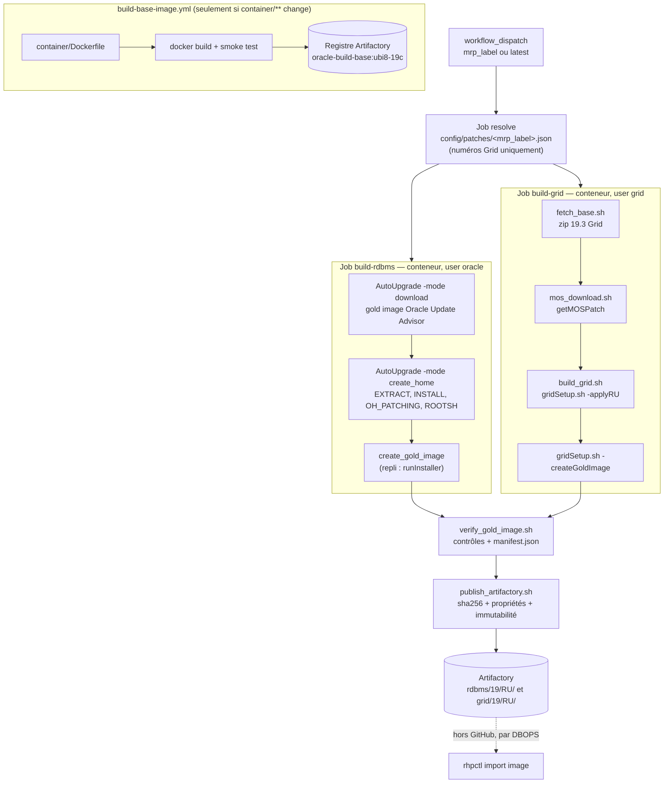

# Oracle 19c gold images — GitHub Actions → Artifactory → FPP

Produit, à chaque MRP mensuel, deux zips de gold image importables tels quels par
`rhpctl import image` :

| Image | Fichier | `-imagetype` |
| --- | --- | --- |
| RDBMS | `db_<MRP>.zip` | `ORACLEDBSOFTWARE` |
| Grid Infrastructure | `gi_<MRP>.zip` | `ORACLEGISOFTWARE` |

L'import dans FPP est fait par DBOPS, hors de ce dépôt.

---

## 1. Principes

1. **Build en conteneur.** Tout s'exécute dans `oracle-build-base` (UBI 8, aucun binaire Oracle).
   Le conteneur est immuable et n'est reconstruit que quand `container/**` change.
2. **Home construit from scratch à chaque run.** Rien n'est réutilisé d'un run à l'autre : pas de
   home « de référence » qui dérive. Côté Grid on part du zip 19.3 stocké dans Artifactory ; côté
   RDBMS, de la gold image fournie par l'Oracle Update Advisor.
3. **Jamais d'`opatch apply` manuel.** Côté Grid, `gridSetup.sh -applyRU/-applyOneOffs` en mode
   software-only. Côté RDBMS, AutoUpgrade assemble le home à partir d'une gold image déjà patchée.
4. **Une seule image par type** pour tout le parc RHEL 7/8/9 : le relink fait par FPP au
   `add workingcopy` absorbe la différence d'OS. Build sur UBI 8.
5. **Rien de sensible dans le dépôt** : ni zip Oracle, ni patch, ni identifiant, ni keystore.

---

## 2. Vue d'ensemble



---

## 3. Pourquoi deux processus différents

**AutoUpgrade ne gère que les homes RDBMS.** Son mode `-patch` connaît les Release Updates, MRP,
OJVM et DPBP de la base de données ; il ne sait rien des homes Grid Infrastructure. Il n'existe donc
aucun outil unique couvrant les deux côtés, et le pipeline assume cette asymétrie plutôt que de la
masquer.

| | RDBMS | Grid Infrastructure |
| --- | --- | --- |
| Numéros de patch | **aucun** — `patch=RECOMMENDED` | fournis par `config/patches/<mrp>.json` |
| Point de départ | gold image préassemblée par l'Oracle Update Advisor | zip 19.3 rapatrié d'Artifactory |
| Téléchargement MOS | AutoUpgrade (`-mode download`) | `getMOSPatch` (`scripts/mos_download.sh`) |
| Authentification MOS | keystore AutoUpgrade, local au runner | secrets GitHub `MOS_USER` / `MOS_PASS` |
| Construction du home | AutoUpgrade `-mode create_home` | `gridSetup.sh -silent -applyRU …` |
| Utilisateur | `oracle` (54321) | `grid` (54322) |
| Gold image | `create_gold_image` (repli `runInstaller -createGoldImage`) | `gridSetup.sh -createGoldImage` |

Côté RDBMS, `create_home` n'exécute que les étapes logicielles — `EXTRACT`, `DBTOOLS`, `INSTALL`,
`ROOH`, `OH_PATCHING`, `OPTIONS`, `ROOTSH` — sans aucune étape base de données : ni `sid`, ni
`source_home`. Le zip 19.3 de base n'est exigé que lorsque `gold_image=NO` ; avec `gold_image=ALL`,
c'est l'Oracle Update Advisor qui fournit le home déjà patché. D'où l'absence totale de numéros de
patch de ce côté.

Le Grid ne bénéficie de rien de tout cela : AutoUpgrade n'installe, ne patche et ne met à jour aucun
home Grid Infrastructure. C'est la raison d'être de la table de patches, qui ne contient donc que
des champs Grid.

---

## 4. Processus RDBMS, étape par étape

| # | Étape | Script |
| --- | --- | --- |
| 1 | Nettoyage de `$JOB_ROOT` et de `$ORACLE_HOME` | `oracle-build-cleanup` (helper root de l'image) |
| 2 | Rapatriement de `autoupgrade.jar` + contrôle sha256 | `scripts/fetch_base.sh` |
| 3 | Génération de `patch.cfg` (substitution des `@@…@@`) | `sed` dans le workflow |
| 4 | `-patch -mode download` : gold image OUA + patches complémentaires | `scripts/build_rdbms_autoupgrade.sh` |
| 5 | `-patch -mode create_home` : extraction, installation, patching, `root.sh` | idem |
| 6 | `opatch lspatches`, `oraversion -compositeVersion` → échec si le RU obtenu ≠ RU visé | idem |
| 7 | Récupération du zip `create_gold_image`, ou repli `runInstaller -createGoldImage` | idem |

**Aucun numéro de patch.** `patch1.patch=RECOMMENDED` laisse AutoUpgrade résoudre le jeu du mois et
`patch1.gold_image=ALL` lui fait demander à l'Oracle Update Advisor une image contenant RU, MRP,
OJVM/DPBP et one-offs recommandés. La sécurité ne repose donc plus sur des numéros saisis, mais sur
un contrôle a posteriori : la version composite du home produit doit correspondre au `ru_version` de
la table, et `lspatches.txt` — publié à côté de l'image — dit exactement ce qui a été assemblé.

**Keystore MOS.** Créé une seule fois à la main sur le runner, monté en lecture seule dans le
conteneur. Aucun identifiant MOS ne transite par le workflow côté RDBMS.

**Repli documenté.** `scripts/build_rdbms.sh` et `config/db_swonly.rsp` construisent le même home par
l'installeur (`runInstaller -applyRU/-applyOneOffs`) à partir du zip 19.3 et de numéros de patch
explicites. Ils ne sont plus câblés dans le workflow, et servent de solution de repli si l'Oracle
Update Advisor est indisponible ou si le jeu `RECOMMENDED` ne convient pas.

---

## 5. Processus Grid, étape par étape

| # | Étape | Script |
| --- | --- | --- |
| 1 | Nettoyage de `$JOB_ROOT` et de `$GRID_HOME` | `oracle-build-cleanup` |
| 2 | Rapatriement du zip 19.3 Grid + contrôle sha256 | `scripts/fetch_base.sh` |
| 3 | Rapatriement de `getMOSPatch.jar` | `scripts/fetch_base.sh` |
| 4 | Téléchargement du GI RU, d'OPatch et des one-offs demandés | `scripts/mos_download.sh` |
| 5 | Unzip 19.3 → `$GRID_HOME`, remplacement d'OPatch, unzip RU + one-offs | `scripts/build_grid.sh` |
| 6 | `gridSetup.sh -silent -applyRU … -applyOneOffs …` (rc 0 ou 6 acceptés) | idem |
| 7 | `orainstRoot.sh` si présent, puis `root.sh` via sudo | idem |
| 8 | `opatch lspatches` → échec si le RU n'y figure pas | idem |
| 9 | `gridSetup.sh -silent -createGoldImage` | idem |

`-ignorePrereqFailure` est nécessaire en conteneur (sysctl, swap, mémoire non représentatifs) et
`CV_ASSUME_DISTID=OL8` est exporté parce que le CVU ne reconnaît pas UBI.

---

## 6. Étapes communes aux deux images

**`scripts/verify_gold_image.sh`** — refuse la publication si :
- `OPatch/opatch`, `inventory/ContentsXML/comps.xml`, `oraclehomeproperties.xml` ou l'installeur
  (`runInstaller` / `gridSetup.sh`) manquent ;
- le zip contient `log/`, `cfgtoollogs/`, des `install/*.log`, des `*.bak`, des `.ora` hors
  `network/admin/samples/`, un `crsconfig_params` (Grid) ou un fichier de paramètres dans `dbs/`
  autre que `init.ora` (RDBMS) ;
- la version composite ne correspond pas au RU demandé ;
- le zip dépasse 8 Go.

Il produit `manifest.json` : `type`, `ru`, `mrp`, `version`, `patches[]` (issus de `lspatches`),
`base_zip_sha256`, `image_sha256`, `image_size`, `build_container_tag`, `commit`, `run_id`, `date`.

**`scripts/publish_artifactory.sh`** — trois fichiers par image (`.zip`, `.lspatches.txt`,
`.manifest.json`) dans `{rdbms,grid}/19/<RU>/`, avec `X-Checksum-Sha256` et propriétés matrix
(`type`, `ru`, `mrp`, `commit`, `run`, `sha256`, `status=built`). Un `HEAD` précède l'upload :
**un objet existant n'est jamais écrasé** sans l'input `force`, parce qu'il a pu être importé dans
FPP. Après upload, le sha256 et la propriété `sha256` sont relus côté serveur.

Chaque job termine par un `detachHome` puis un nettoyage `if: always()`, et affiche `df -h` avant
et après.

---

## 7. Acquisition des numéros de patch

Les numéros ne sont plus saisis au lancement : ils vivent dans une **table versionnée**,
`config/patches/<mrp_label>.json`, lue par le job `resolve`
(`scripts/resolve_patches.sh`). Un build est donc rejouable à l'identique et chaque changement de
numéro passe par une PR.

```json
{
  "mrp_label": "19.28.0.0.250915",
  "ru_version": "19.28",
  "gi_ru_patch": "38xxxxxx",
  "gi_oneoffs": "38xxxxxx,38xxxxxx",
  "opatch_patch": "6880880"
}
```

Le résolveur refuse le run si une clé obligatoire manque, si `mrp_label` diffère du nom du fichier,
si `mrp_label` ne commence pas par `ru_version`, ou si un numéro n'est pas strictement numérique —
ces valeurs alimentent des chemins Artifactory et des lignes de commande. Détail des champs :
[`config/patches/README.md`](config/patches/README.md).

Le workflow ne prend plus que quatre inputs : `mrp_label` (`latest` par défaut, = la table la plus
récente au tri de version), `build_rdbms`, `build_grid`, `force`.

**Ce qui reste manuel** : relever les numéros **Grid** du mois sur MOS et remplir le fichier. Le
RDBMS n'en demande aucun. Si un jour AutoUpgrade couvre les homes Grid, la table disparaît.

## 8. Runbook mensuel

1. Relever les numéros de patch Grid du mois (GI RU, MRP GI) sur MOS.
2. `cp config/patches/TEMPLATE.json config/patches/<mrp_label>.json`, remplir, PR, merge.
3. `workflow_dispatch` sur `oracle-gold-images.yml` — `mrp_label=latest` suffit.
4. `resolve` valide la table, puis les deux jobs tournent en parallèle
   (< 3 h attendu, `timeout-minutes: 180`).
5. Lire le résumé du run : URLs, sha256, commandes `rhpctl import image` prêtes à copier.
6. Transmettre à DBOPS pour l'import FPP.

Rejouer le même MRP sans `force` échoue volontairement à la publication (immutabilité).

## 9. Import côté FPP (DBOPS)

```bash
curl -fsS -H "Authorization: Bearer $TOKEN" -o /fpp/staging/gi_19.28.0.0.250915.zip \
  "$ART/$ARTIFACTORY_REPO/grid/19/19.28/gi_19.28.0.0.250915.zip"
sha256sum /fpp/staging/gi_19.28.0.0.250915.zip   # comparer au manifeste / à la propriété sha256

rhpctl import image -image gi_19_28_0_0_250915 -zip /fpp/staging/gi_19.28.0.0.250915.zip \
  -imagetype ORACLEGISOFTWARE -series gi19
rhpctl import image -image db_19_28_0_0_250915 -zip /fpp/staging/db_19.28.0.0.250915.zip \
  -imagetype ORACLEDBSOFTWARE -series db19
```

### Relocaliser une image vers un autre chemin

Le chemin utilisé au build **n'est pas contractuel**. L'image est un home relocalisable : c'est
`rhpctl add workingcopy` qui décide où le home atterrit et FPP relink en conséquence. Une seule
image sert donc plusieurs conventions de chemins.

| Option | Rôle |
| --- | --- |
| `-path <chemin>` | `ORACLE_HOME` cible sur le client. **Le répertoire doit être vide.** Obligatoire avec `-storagetype LOCAL`, interdit avec `RHP_MANAGED`. |
| `-oraclebase <chemin>` | `ORACLE_BASE` cible. Obligatoire pour les images `ORACLEDBSOFTWARE` et `ORACLEGISOFTWARE`. |
| `-user <user>` | Propriétaire du home provisionné (défaut : l'utilisateur qui lance la commande). **Incompatible avec `-softwareonly`.** |
| `-inventory <chemin>` | Inventaire central de la cible, s'il diffère. |
| `-client <cluster>` / `-targetnode <nœud>` | Cluster client FPP, ou nœud distant sans client FPP. |

RDBMS — image construite sous `/u01/app/oracle/product/19.0.0/dbhome_1`, déployée ailleurs :

```bash
rhpctl add workingcopy -workingcopy db_19_28_0_0_250915_cl01 \
  -image db_19_28_0_0_250915 \
  -oraclebase /u02/app/oracle \
  -path /u02/app/oracle/product/19.0.0/dbhome_3 \
  -storagetype LOCAL -user oracle -client cluster01
```

Grid software-only — image construite sous `/u01/app/19.0.0/grid` :

```bash
rhpctl add workingcopy -workingcopy gi_19_28_0_0_250915_cl01 \
  -image gi_19_28_0_0_250915 \
  -oraclebase /u02/app/grid \
  -path /u02/app/19.0.0/grid \
  -softwareonly -client cluster01
```

Le nom du working copy est libre : rien n'oblige à reprendre le nom de l'image. Un `-eval` en
préfixe de la commande valide le placement sans rien provisionner, et l'aide contextuelle donne les
variantes par cas d'usage :

```bash
rhpctl add workingcopy -help SWONLYGRIDHOMEPROV   # Grid software-only
rhpctl add workingcopy -help GRIDHOMEPROV         # Grid configuré
rhpctl add workingcopy -help STORAGETYPE          # LOCAL vs RHP_MANAGED
rhpctl add workingcopy -help REMOTEPROVISIONING   # cible sans client FPP
```

Source : [rhpctl add workingcopy — Oracle FPP 19c](https://docs.oracle.com/en/database/oracle/oracle-database/19/fppad/workingcopy-commands.html).

---

## 10. Arborescence

```
.github/workflows/build-base-image.yml   # build + smoke test + push du conteneur de base
.github/workflows/oracle-gold-images.yml # orchestration des deux gold images
container/Dockerfile                     # UBI 8 + prérequis 19c (voir container/README.md)
config/patches/<mrp_label>.json          # table de patches du mois (source unique des numéros)
config/autoupgrade-patch.cfg             # AutoUpgrade, téléchargement seul
config/db_swonly.rsp                     # response file DB software-only
config/grid_swonly.rsp                   # response file Grid software-only
scripts/resolve_patches.sh               # lit la table de patches et alimente les jobs
scripts/fetch_base.sh                    # récupère un artefact Artifactory + vérifie le sha256
scripts/mos_download.sh                  # patches GI depuis MOS
scripts/build_rdbms_autoupgrade.sh       # home DB + gold image via AutoUpgrade (chemin nominal)
scripts/build_rdbms.sh                   # repli : home DB par l'installeur, avec numéros de patch
scripts/build_grid.sh                    # home Grid patché + gold image
scripts/verify_gold_image.sh             # contrôles avant publication + manifest.json
scripts/publish_artifactory.sh           # publication immuable + relecture des métadonnées
```

---

## 11. Chemins et identités

| Élément | Valeur |
| --- | --- |
| `ORACLE_HOME` | `/u01/app/oracle/product/19.0.0/dbhome_1` |
| `ORACLE_BASE` | `/u01/app/oracle` |
| `GRID_HOME` | `/u01/app/19.0.0/grid` |
| Inventaire | `/u01/app/oraInventory` (dans le conteneur, jetable) |
| Espace de travail | `/u01/gha` (monté depuis l'hôte) |
| UID/GID | `oracle=54321`, `grid=54322`, `oinstall=54321`, `dba=54322` |

Le chemin n'est pas contractuel — FPP relocalise au `add workingcopy`, voir
[§9](#relocaliser-une-image-vers-un-autre-chemin) — mais reste aligné sur les VM pour éliminer une
variable.

---

## 12. Prérequis

**Runner self-hosted, label `oracle-build`**
- Docker, accès Artifactory et MOS, ≥ 60 Go libres sous `/u01/gha` (propriétaire `oracle:oinstall`).
- Keystore AutoUpgrade créé **une seule fois** sous `/u01/gha/autoupgrade/keystore`
  (propriétaire `oracle`, mode 700), jamais committé :
  ```bash
  java -jar autoupgrade.jar -config patch.cfg -patch -load_password
  # add MOS
  # save -convert_to_auto_login
  # exit
  ```
- Un seul build à la fois par runner (`concurrency` côté GitHub).

**Artifactory**
- `BASE_IMAGES_REPO` : `oracle/19.3/LINUX.X64_193000_grid_home.zip` (le zip DB n'est nécessaire que
  pour le chemin de repli `scripts/build_rdbms.sh`).
- `TOOLS_REPO` : `autoupgrade/<version>/autoupgrade.jar`, `getmospatch/getMOSPatch.jar`.
- `ARTIFACTORY_REPO` : dépôt Generic local, layout `{rdbms,grid}/19/<RU>/<fichier>`.
- Registre de conteneurs pour `dbops/oracle-build-base`.

**Secrets GitHub** : `MOS_USER`, `MOS_PASS` (Grid uniquement), `ARTIFACTORY_TOKEN`.
**Variables GitHub** : `ARTIFACTORY_URL`, `ARTIFACTORY_USER`, `ARTIFACTORY_REPO`,
`BASE_IMAGES_REPO`, `TOOLS_REPO`, `CONTAINER_REGISTRY`, `AUTOUPGRADE_VERSION`.

---

## 13. Points à valider en pilote

- Version d'`autoupgrade.jar` déployée : `gold_image`, `create_gold_image` et `method` sont
  documentés côté 26. Vérifier qu'ils sont acceptés, sinon publier un jar plus récent.
- Emplacement du zip produit par `create_gold_image` : non documenté. Le script le cherche puis
  se replie sur `runInstaller -createGoldImage`. Consigner ici ce qu'un run réel montre.
- Contenu réel de la gold image OUA : comparer `lspatches.txt` au MRP attendu. Si le jeu
  `RECOMMENDED` ne convient pas, figer avec `patch1.patch=RU:<ver>,MRP,OPATCH,OJVM` ou basculer sur
  le repli `scripts/build_rdbms.sh`.
- `CV_ASSUME_DISTID=OL8` : confirmer que le CVU accepte UBI 8 avec cette valeur.
- Acceptation par `rhpctl import image` des zips produits en conteneur (FPP vérifie version et
  plateforme à l'import).
- UID/GID réels des VM du parc, si différents des défauts Oracle.
